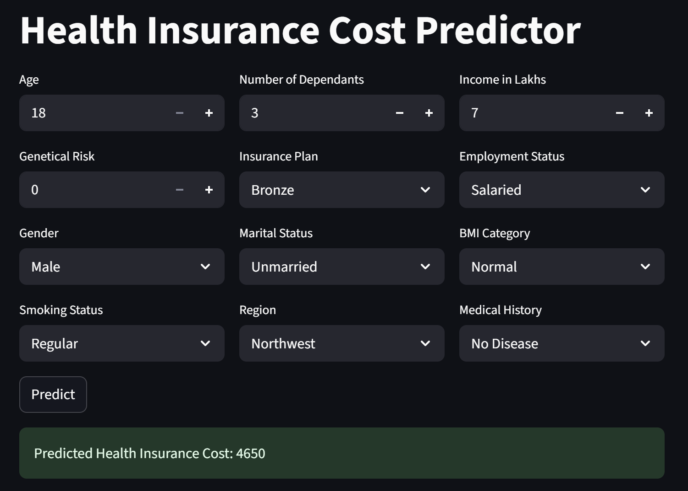

# 🚀 Health Insurance Cost Predictor 🚀

**Tagline:** "Predicting the future of healthcare costs, one model at a time!"

📖 **Description**
---------------

The **Health Insurance Cost Predictor** is a Python-based web application designed to forecast the future health insurance costs for individuals. By leveraging machine learning algorithms and predesigned models, this project aims to help insurance companies, healthcare providers, and individuals make informed decisions about their insurance plans and costs. The application utilizes **Streamlit** as its frontend framework, allowing users to interact with an intuitive and user-friendly interface.

The project consists of two core files: `main.py` and `prediction_helper.py`. The former is responsible for setting up the web application, while the latter contains the machine learning models and preprocessing utilities.

✨ **Features**
------------

1. **Interactive Web Interface**: A user-friendly interface built using Streamlit, allowing users to input their demographic information and receive a predicted health insurance cost estimate.  
2. **Machine Learning Models**: Two pre-trained models, one for young individuals and one for those over 65, which utilize joblib to load and predict health insurance costs.  
3. **Data Preprocessing**: Utilizes pandas to load and preprocess data, and joblib to load and scale data for model training.  
4. **Model Selection**: Allows users to choose between the two pre-trained models based on their age group.  
5. **Predictions**: Generates predicted health insurance costs based on the selected model and user input.  
6. **Error Handling**: Handles errors and exceptions gracefully, ensuring a seamless user experience.  
7. **Code Organization**: Project files are neatly organized, making it easy to navigate and maintain the codebase.  
8. **Configurable**: Allows for easy modification of model parameters and input data.  

🧰 **Tech Stack**
--------------

| **Category** | **Technology** |  
| --- | --- |  
| Frontend | Streamlit |  
| Backend | Python |  
| Data Processing | pandas, joblib |  
| Data Storage | None (in-memory) |  

📁 **Project Structure**
-------------------

```
health_insurance_cost_predictor/
│── main.py
│── prediction_helper.py
│── artifacts/
│   ├── model_young.joblib
│   ├── model_rest.joblib
│   ├── scaler_young.joblib
│   └── scaler_rest.joblib
│── requirements.txt
```  

⚙️ **How to Run**
----------------  

1. **Setup**: Install the required dependencies by running:  
   ```bash
   pip install -r requirements.txt
   ```
2. **Environment**: Ensure you have a Python environment set up with the required libraries installed.  
3. **Build**: Run the application:  
   ```bash
   streamlit run main.py
   ```
4. **Deploy**: Deploy the application to a server or cloud platform of your choice.  

   ```  


📸 **Screenshots**
-----------------  

  

👤 **Author**
------------  
**Ankit Kumar Tripathy**  

📝 **License**
----------  
This project is licensed under the **MIT License**. See [LICENSE](LICENSE) for details.  

